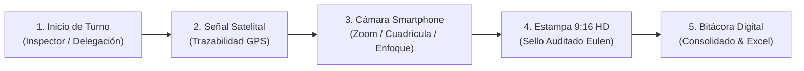

# Manual e Instructivo Operativo: HSEQ Field Master Pro
### Plataforma de Supervisión Técnica, Trazabilidad GPS y Registro Fotográfico Auditado
**Grupo Eulen Colombia — Dirección de Seguridad, Salud en el Trabajo, Calidad y Medio Ambiente (HSEQ)**

---

## 🌐 Enlace Oficial de Acceso en Vivo
Para ingresar a la plataforma desde cualquier dispositivo móvil o computador, abre el siguiente enlace en tu navegador web:
👉 **[https://eulen-gruop.vercel.app/](https://eulen-gruop.vercel.app/)**

> [!NOTE]
> La plataforma opera como una **Aplicación Web Progresiva (PWA)** con soporte para trabajo en campo, conexión SSL segura y compatibilidad directa con dispositivos Android, iOS (iPhone/iPad) y computadores portátiles o de escritorio.

---

## 📑 Tabla de Contenidos del Instructivo
1. [Objetivo y Alcance del Sistema](#1-objetivo-y-alcance-del-sistema)
2. [Paso 1: Ingreso y Apertura de Turno de Supervisión](#paso-1-ingreso-y-apertura-de-turno-de-supervisión)
3. [Paso 2: Diagnóstico y Concesión de Permisos (Cámara y GPS)](#paso-2-diagnóstico-y-concesión-de-permisos-cámara-y-gps)
4. [Paso 3: Monitoreo Satelital y Alerta de Trazabilidad GPS](#paso-3-monitoreo-satelital-y-alerta-de-trazabilidad-gps)
5. [Paso 4: Uso de la Cámara Dinámica Smartphone](#paso-4-uso-de-la-cámara-dinámica-smartphone)
6. [Paso 5: Registro del Hallazgo y Estampado Fotográfico 9:16](#paso-5-registro-del-hallazgo-y-estampado-fotográfico-916)
7. [Paso 6: Monitoreo Continuo y Exportación de Rutas GPS](#paso-6-monitoreo-continuo-y-exportación-de-rutas-gps)
8. [Paso 7: Asistente Virtual y Bitácora Diaria Consolidada](#paso-7-asistente-virtual-y-bitácora-diaria-consolidada)
9. [Paso 8: Instalación en la Pantalla de Inicio del Móvil (PWA)](#paso-8-instalación-en-la-pantalla-de-inicio-del-móvil-pwa)
10. [Guía Rápida de Solución de Problemas (Troubleshooting)](#10-guía-rápida-de-solución-de-problemas-troubleshooting)

---

## 1. Objetivo y Alcance del Sistema

**HSEQ Field Master Pro** es la herramienta digital desarrollada exclusivamente para los supervisores, inspectores y coordinadores de **Grupo Eulen Colombia**. Su propósito es:

1. **Garantizar la Trazabilidad Legal:** Vincular automáticamente coordenadas satelitales en tiempo real, fecha, hora, clima y datos del puesto de trabajo a cada evidencia fotográfica.
2. **Estandarizar la Imagen Corporativa:** Aplicar el sello oficial de Grupo Eulen en alta definición con el contraste cromático corporativo (Azul Eulen `#002664` y Cian de Seguridad `#00a9e0`).
3. **Agilizar el Cierre Operacional:** Consolidar recorridos, capacitaciones y novedades en un informe diario listo para enviar a la gerencia de operaciones y a los clientes en formato texto o Microsoft Excel.



---

## Paso 1: Ingreso y Apertura de Turno de Supervisión

Al ingresar a **[https://eulen-gruop.vercel.app/](https://eulen-gruop.vercel.app/)**, la plataforma se inicia automáticamente y despliega la ventana de **Inicio de Turno**:


### Instrucciones de Diligenciamiento:
1. **Nombre del Supervisor / Inspector:** Digita tu nombre y apellidos completos (ej: *Juan Carlos Rodríguez*).
2. **Delegación:** Selecciona o escribe la delegación regional a la que perteneces (ej: *Delegación Bogotá*, *Delegación Medellín*, *Delegación Cali*, *Delegación Barranquilla*).
3. **Nombre de Cliente:** Especifica la razón social del cliente o instalación donde se ejecuta la operación (ej: *Centro Logístico San Cayetano*, *Banco Santander - Sede Central*, *Hospital Universitario*).
4. Presiona el botón azul: **INICIAR JORNADA Y ACTIVAR RASTREO**.

> [!TIP]
> Si en el transcurso del día cambias de sede o de cliente, puedes presionar en cualquier momento el botón **"Config Inspector"** en la sección 3 para actualizar estos datos sin perder tu historial.

---

## Paso 2: Diagnóstico y Concesión de Permisos (Cámara y GPS)

Para que el sistema capture fotografías y registre las coordenadas satelitales, el navegador web te solicitará autorización de hardware:

1. **Permiso de Ubicación:** Cuando aparezca el aviso emergente `¿Desea permitir que eulen-gruop.vercel.app use su ubicación?`, presiona **Permitir** o **Mientras la app esté en uso**.
2. **Permiso de Cámara:** Al abrir la cámara por primera vez, selecciona **Permitir**.

### ¿Cómo verificar el estado de permisos?
En la esquina superior derecha del encabezado, haz clic en el botón con icono de escudo **"Permisos"**:
- **Protocolo Web (SSL/HTTPS):** Debe indicar `SEGURO (HTTPS)` en verde.
- **Chip GPS / Geolocalización:** Debe marcar `CONCEDIDO` en verde.
- **Acceso a Cámara Móvil:** Debe marcar `CONCEDIDO` en verde.

---

## Paso 3: Monitoreo Satelital y Alerta de Trazabilidad GPS

La plataforma cuenta con un motor inteligente de georreferenciación satelital que protege la autenticidad de cada inspección:

### 1. Píldora de Estado GPS en el Encabezado:
- **⚠️ En búsqueda o inactivo (Color Rojo/Ámbar intermitente):** Indica que el GPS de tu móvil está apagado, en interiores profundos o el navegador no tiene permiso. Al tocarlo se abrirá el diagnóstico de ayuda.
- **✅ Conectado y Verificado (Color Verde Esmeralda pulsante):** Muestra las coordenadas en tiempo real y el margen de precisión estimado (ej: `4.609712, -74.081734 (±4m)`). Al tocarlo se abre el menú para compartir tu ubicación por WhatsApp.

### 2. Banner Flotante de Alerta de Trazabilidad:
Si el dispositivo aún no ha fijado la señal satelital, verás un cartel de advertencia en la parte superior:
> **⚠️ ALERTA DE TRAZABILIDAD HSEQ: Ubicación GPS No Detectada**
> *Para certificar la validez legal ante Grupo Eulen y clientes, activa la ubicación de tu móvil.*

* **El sistema reintenta automáticamente en segundo plano cada 4.5 segundos.** En cuanto salgas a una zona con cobertura o enciendas el GPS en los ajustes rápidos de tu celular, el cartel desaparecerá por sí solo y se tornará en una confirmación verde:
  `✅ Trazabilidad HSEQ Verificada: Señal satelital activa en tiempo real (+/- 4m).`

---

## Paso 4: Uso de la Cámara Dinámica Smartphone

Presiona el botón **"Abrir Cámara"** en el Paso 2 para desplegar el visor vertical en relación **9:16 (Pantalla Celular)** con todas las funciones de un teléfono inteligente moderno:

| Control | Icono / Ubicación | Función Operativa en Campo |
| :--- | :---: | :--- |
| **Píldoras de Zoom Rápido** | `0.8x`, `1x`, `2x`, `3x`, `5x` | Ampliación instantánea para inspeccionar detalles distantes (techos, andamios, cables). |
| **Deslizador de Zoom** | Barra inferior | Deslizamiento suave milimétrico para graduar el aumento exacto (ej: 1.6x). |
| **Gesto Pinch-to-Zoom** | Pantalla táctil | Pellizca la pantalla con dos dedos para acercar o alejar el objetivo de forma natural. |
| **Cuadrícula 3x3** | Barra superior (`fa-border-all`) | Activa líneas guía de la regla de los tercios para encuadrar vertical y horizontalmente. |
| **Enfoque Táctil** | Toque en la pantalla | Toca cualquier objeto o persona para centrar el recuadro amarillo de enfoque con destello solar. |
| **Temporizador (Timer)** | Barra superior (`fa-stopwatch`) | Alterna entre disparo instantáneo o cuenta regresiva de 3 segundos para estabilizar la toma. |
| **Linterna / Flash** | Barra superior (`fa-bolt`) | Enciende el LED de iluminación continua en sótanos, ductos o áreas de escasa luz. |
| **Control de Exposición** | Botón de sol / Barra vertical | Aclara u oscurece la imagen para compensar reflejos o sombras intensas. |
| **Rotación de Cámara** | Botón de giro (`fa-camera-rotate`) | Alterna entre el lente principal trasero y la cámara frontal para auto-inspecciones. |
| **Obturador Smartphone** | Botón circular central | Dispara la toma con vibración háptica en la mano y destello visual blanco de confirmación. |

> [!IMPORTANT]
> **Protección contra Fraude en Auditoría:** Si intentas capturar una imagen mientras el GPS está inactivo, el sistema te mostrará una alerta de confirmación preventiva. Podrás reintentar el enganche satelital o continuar bajo registro explícito de advertencia.

---

## Paso 5: Registro del Hallazgo y Estampado Fotográfico 9:16

Una vez capturada la fotografía (o subida desde la galería mediante el botón *"Subir Galería"*), sigue estos sencillos pasos:

1. **Selecciona el Tipo de Registro:**
   - **Acto Inseguro** (Borde y resalte Rojo `#f5333f`)
   - **Condición Insegura** (Borde y resalte Ámbar `#f59e0b`)
   - **Problemática Ambiental** (Borde y resalte Verde `#10b981`)
   - **Seguimiento Eulen** (Borde y resalte Azul `#00a9e0`)
   - **Capacitación / Charla 5 Minutos** (Borde y resalte Púrpura `#8b5cf6`)

2. **Diligencia los Detalles Técnicos:**
   - **Servicio / Actividad:** Selecciona en el menú desplegable la tarea evaluada (ej: *Servicios de Seguridad y Vigilancia*, *Facility Services / Mantenimiento*, *Trabajo en Alturas*, etc.).
   - **Estado del Clima:** Registra la condición ambiental (ej: *☀️ Soleado 24°C*, *🌧️ Lluvia Moderada*, etc.).
   - **Observación / Hallazgo:** Redacta con precisión la situación evidenciada, acciones tomadas y medidas correctivas.

3. **Personaliza el Estilo del Vidrio (Glassmorphism):**
   - Elige entre **Azul Eulen Translúcido** (recomendado para máxima elegancia y contraste) o **Blanco Claro Tenue**.
   - Ajusta la barra de opacidad a tu gusto (por defecto 82%).

4. **Visualiza la Estampa Proporcional:**
   - En la sección derecha verás la imagen generada en **1080 x 1920 píxeles**.
   - El banner ocupa únicamente el 16% inferior, dejando el **84% superior completamente libre** para apreciar la evidencia sin obstrucciones.
   - El sello inferior incluye la etiqueta legal:
     - `UBICACIÓN GPS: [Coordenadas] (±Xm) ✅ VERIFICADO`
     - O en caso de falla satelital: `UBICACIÓN GPS: ⚠️ NO VERIFICADA (GPS INACTIVO)`.

5. **Descarga Oficial:**
   - Presiona el botón verde grande: **"Descargar Foto Estampada con Logo Eulen"**.
   - Se guardará un archivo `.png` de alta resolución en la galería o descargas de tu teléfono, listo para compartir por WhatsApp o radicar en informes.

---

## Paso 6: Monitoreo Continuo y Exportación de Rutas GPS

Haz clic en la pestaña **"Rastreo GPS"** en la barra superior para acceder a la consola de geoposicionamiento:

- **Tarjeta de Estado:** Muestra si el rastreo está activo, la cantidad de puntos capturados durante la jornada y las coordenadas instantáneas.
- **Historial de Puntos:** Tabla técnica que desglosa cada parada o recorrido con:
  1. Hora exacta de extracción.
  2. Coordenadas Decimales (DD) (ej: `4.609712, -74.081734`).
  3. Coordenadas en Grados, Minutos y Segundos (DMS/GMS).
  4. Precisión satelital (±X metros).
- **Botón "Compartir WhatsApp / Mapa":** Genera un mensaje corporativo estructurado con enlace directo a Google Maps para enviar la posición a la central de operaciones.
- **Botón "Exportar Ruta a Excel (.XLSX)":** Descarga una hoja de cálculo con la matriz georreferenciada de todo el recorrido, lista para auditar o importar en Google Earth, QGIS o sistemas de información geográfica.

---

## Paso 7: Asistente Virtual y Bitácora Diaria Consolidada

Haz clic en la pestaña **"Asistente Bitácora"** para estructurar el informe ejecutivo de tu jornada sin necesidad de redactar desde cero:

1. **Entrevista Dinámica con el Chatbot:**
   El asistente te formulará 6 preguntas puntuales:
   - *¿A qué hora iniciaste el turno o recorrido?*
   - *¿A qué hora finalizaste el servicio?*
   - *¿Cuántas sedes, puestos o frentes supervisaste hoy?*
   - *¿Se detectaron actos inseguros, condiciones anómalas o aspectos ambientales?*
   - *¿Se realizó charla de 5 minutos o capacitación al personal?*
   - *¿Conclusiones o indicaciones para el Administrador HSEQ / Operaciones?*

2. **Sincronización Automática con GPS:**
   Presiona el botón **"Sincronizar GPS"** para inyectar automáticamente al informe la Delegación, el Cliente, el Clima y la totalidad de puntos satelitales registrados en el día.

3. **Consolidación Ejecutiva:**
   A la derecha se redactará automáticamente el informe institucional con el membrete oficial:
   ```text
   ==================================================
         GRUPO EULEN COLOMBIA - HSEQ FIELD PRO
      INFORME Y BITÁCORA DIARIA DE CAMPO Y SUPERVISIÓN
   ==================================================
   • DELEGACIÓN:             DELEGACIÓN BOGOTÁ
   • NOMBRE DE CLIENTE:      CENTRO LOGÍSTICO SAN CAYETANO
   • SUPERVISOR / INSPECTOR: JUAN CARLOS RODRÍGUEZ
   • FECHA DE OPERACIÓN:     JUEVES, 17 DE SEPTIEMBRE DE 2026
   • HORA DE GENERACIÓN:     01:45 PM
   • CLIMA REGISTRADO:       ☀️ SOLEADO | 24°C
   ...
   ```

4. **Opciones de Salida:**
   - **Copiar Texto:** Copia todo el cuerpo del informe al portapapeles para pegarlo directamente en un correo electrónico o chat corporativo.
   - **Descargar Excel Eulen:** Genera un archivo `.xlsx` profesional estructurado con dos pestañas: *Resumen Ejecutivo Eulen* y *Ruta GPS Eulen*.

---

## Paso 8: Instalación en la Pantalla de Inicio del Móvil (PWA)

Para acceder a la plataforma con un solo toque como si fuera una aplicación instalada de Google Play o App Store, sin barra de navegación:

### En teléfonos Android (Google Chrome):
1. Abre [https://eulen-gruop.vercel.app/](https://eulen-gruop.vercel.app/) en Google Chrome.
2. Toca el menú de tres puntos verticales `⋮` en la esquina superior derecha.
3. Selecciona **"Instalar aplicación"** o **"Agregar a la pantalla principal"**.
4. Confirma el nombre (*Eulen HSEQ Pro*) y pulsa **Instalar**.
5. Ahora tendrás el icono oficial de Grupo Eulen en el escritorio de tu celular.

### En teléfonos iPhone (Apple Safari):
1. Abre [https://eulen-gruop.vercel.app/](https://eulen-gruop.vercel.app/) en Safari.
2. Toca el botón de **Compartir** (icono de cuadrado con flecha hacia arriba `⎋` en la parte inferior).
3. Desplázate hacia abajo y presiona **"Agregar al inicio"** (icono con signo `+`).
4. Pulsa **Agregar** en la esquina superior derecha.

---

## 10. Guía Rápida de Solución de Problemas (Troubleshooting)

### ❓ La cámara no se abre o se queda en negro:
- **Causa:** El navegador no tiene permiso de cámara o la cámara está siendo usada por otra aplicación (como WhatsApp o Teams).
- **Solución:** Cierra las demás aplicaciones de cámara, toca el icono de candado 🔒 al lado de la barra de URL en Chrome, entra en *Permisos* > *Cámara* y selecciona *Permitir*. Luego pulsa *"Abrir Cámara"*.

### ❓ El sistema muestra "⚠️ Alerta de Trazabilidad: Ubicación GPS no detectada":
- **Causa:** El interruptor de ubicación de tu teléfono está apagado o te encuentras en un sótano o estructura de concreto blindado.
- **Solución:**
  1. Desliza la barra de notificaciones de tu teléfono y enciende el icono de **Ubicación / GPS**.
  2. Si estás en interiores, acércate a una ventana o salida durante unos segundos para facilitar el enganche de los satélites.
  3. Presiona el botón blanco **"Activar / Reintentar GPS"** en el banner rojo.

### ❓ ¿Se pueden recuperar los datos si se cierra la pestaña por error?
- La plataforma guarda el estado localmente mientras mantengas abierta la sesión del navegador. Para finalizar la jornada con total seguridad, se recomienda descargar la foto estampada y generar el Excel de bitácora antes de apagar el dispositivo.

---

> [!IMPORTANT]
> **Compromiso Grupo Eulen Colombia:** La exactitud técnica de los registros fotográficos y la georreferenciación satelital son pilares de la excelencia operacional y del cumplimiento de las normativas de seguridad laboral vigentes.
